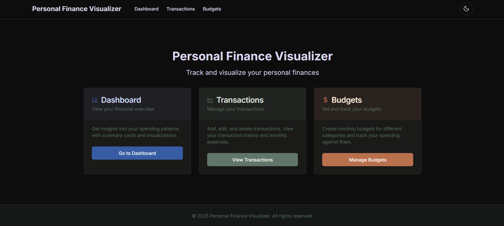
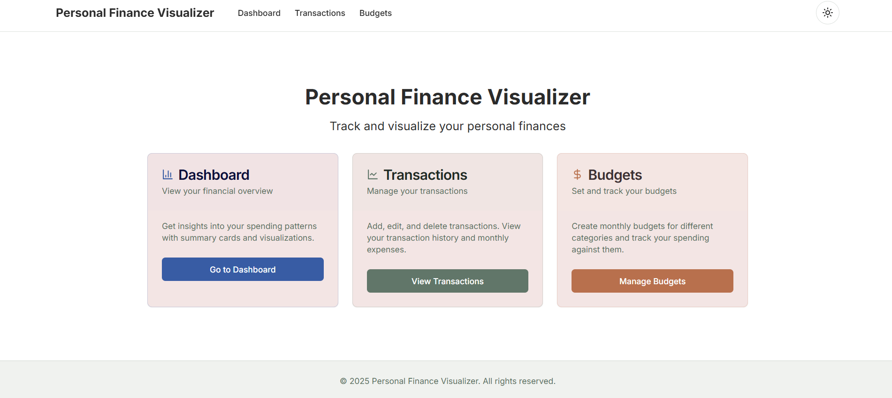
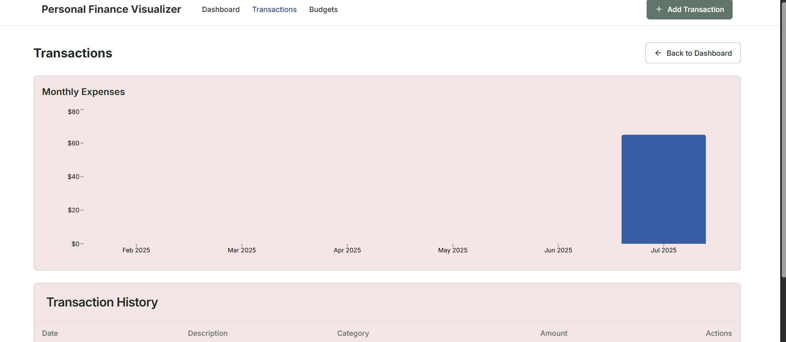
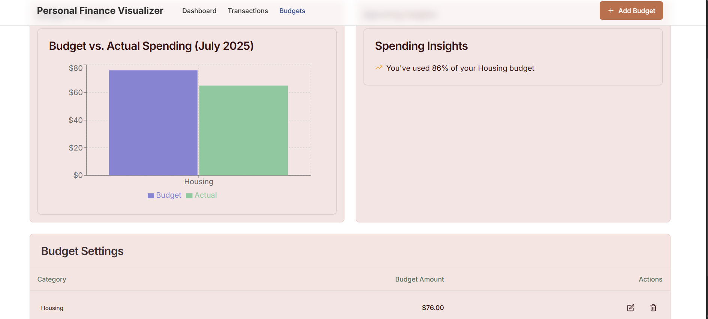

# 💰 Personal Finance Visualizer

<div align="center">

[](https://personalfinancevisualizer-gamma.vercel.app/)

**A comprehensive web application for tracking and visualizing personal finances**

*Track expenses • Set budgets • Gain insights • Make informed financial decisions*

[🚀 Live Demo](https://personalfinancevisualizer-gamma.vercel.app/) • [📖 Documentation](#features) • [🛠️ Setup](#setup-instructions)

</div>

---

## 📸 Screenshots

<div align="center">

### 🏠 Dashboard Overview


*Comprehensive dashboard with summary cards, recent transactions, and spending insights*

### 🌙 Dark Mode Support
 

*Seamless dark and light theme support for comfortable viewing*

### 💳 Transaction Management


*Advanced transaction management with filtering, sorting, and categorization*

### 📊 Budget Tracking


*Smart budget tracking with visual comparisons and spending insights*

</div>

---

## ✨ Features

### 🎯 **Stage 1: Core Transaction Tracking**
- ✅ **Smart Transaction Management** - Add, edit, and delete transactions with comprehensive details
- ✅ **Advanced Filtering** - Sort and filter by date, amount, category, and custom criteria
- ✅ **Visual Analytics** - Monthly expenses bar chart with trend analysis
- ✅ **Form Validation** - Robust input validation with real-time error feedback

### 🏷️ **Stage 2: Intelligent Categorization**
- ✅ **Predefined Categories** - Organize transactions with smart categorization
- ✅ **Interactive Visualizations** - Category-wise pie charts with hover insights
- ✅ **Comprehensive Dashboard** - Summary cards featuring:
  - 💰 Total income and expenses tracking
  - 📊 Category breakdown with percentage analysis
  - ⚡ Recent transactions with quick actions
  - 📈 Spending trend indicators

### 📈 **Stage 3: Advanced Budgeting**
- ✅ **Monthly Budget Management** - Set and track category-specific budgets
- ✅ **Budget vs Actual Analysis** - Visual comparison charts with variance insights
- ✅ **AI-Powered Insights** - Personalized spending recommendations
- ✅ **Smart Alerts** - Proactive notifications for budget overruns
- ✅ **Progress Tracking** - Real-time budget utilization monitoring

---

## 🛠️ Tech Stack

<div align="center">

| **Frontend** | **Backend** | **Database** | **Styling** |
|:------------:|:-----------:|:------------:|:-----------:|
|  |  |  |  |
|  |  |  |  |

</div>

### 🎨 **Visualization & Charts**
- **Recharts** - Interactive and responsive chart library
- **Custom Components** - Specialized visualization components
- **Real-time Updates** - Dynamic chart updates with data changes

### 🔧 **State Management & Forms**
- **React Context API** - Theme and global state management
- **React Hook Form** - Efficient form handling with validation
- **Zod** - Type-safe schema validation

---

## 🚀 Setup Instructions

### 📋 Prerequisites
```bash
Node.js 18+ ✅
npm or yarn ✅
MongoDB Atlas account ✅
Git ✅
```

### ⚡ Quick Start

1. **Clone the repository**
```bash
git clone https://github.com/yourusername/personal-finance-visualizer.git
cd personal-finance-visualizer
```

2. **Install dependencies**
```bash
npm install
# or
yarn install
```

3. **Environment Setup**
Create a `.env.local` file:
```env
MONGODB_URI=your_mongodb_connection_string
```

4. **Launch Development Server**
```bash
npm run dev
# or
yarn dev
```

5. **Open Application**
Navigate to [http://localhost:3000](http://localhost:3000)

### 🧪 Testing Data

Populate your application with sample data:

- **Via UI**: Use the intuitive interface to create transactions and budgets
- **Via API**: Use the RESTful endpoints:
  - `POST /api/transactions` - Create transactions
  - `POST /api/budgets` - Create budgets

---

## 📁 Project Architecture

```
📦 personal-finance-visualizer/
├── 📂 src/
│   ├── 📂 app/                    # Next.js App Router
│   │   ├── 📂 api/                # Serverless API routes
│   │   │   ├── 📂 transactions/   # Transaction endpoints
│   │   │   └── 📂 budgets/        # Budget endpoints
│   │   ├── 📂 dashboard/          # Dashboard page
│   │   ├── 📂 transactions/       # Transaction management
│   │   └── 📂 budgets/            # Budget management
│   ├── 📂 components/             # React components
│   │   ├── 📂 ui/                 # shadcn/ui components
│   │   ├── 📂 charts/             # Chart components
│   │   │   ├── 📊 BudgetComparisonChart.tsx
│   │   │   ├── 📊 CategoryPieChart.tsx
│   │   │   └── 📊 MonthlyExpensesChart.tsx
│   │   ├── 📂 dashboard/          # Dashboard components
│   │   ├── 📂 transactions/       # Transaction components
│   │   └── 📂 budgets/            # Budget components
│   └── 📂 lib/                    # Utilities & models
│       ├── 📂 models/             # MongoDB models
│       ├── 🔧 utils.ts            # Utility functions
│       └── 🗄️ db.ts               # Database connection
└── 📂 images/                     # Screenshots
    ├── 📸 dashboard.png
    ├── 📸 light.png
    ├── 📸 dark.png
    ├── 📸 transactions.png
    └── 📸 budget.png
```

---

## 🌐 Deployment

### Vercel Deployment (Recommended)

1. **Connect Repository**
   - Push code to GitHub
   - Connect repository to Vercel

2. **Environment Variables**
   Add in Vercel dashboard:
   ```
   MONGODB_URI=your_mongodb_connection_string
   ```

3. **Deploy**
   - Automatic deployments on every push
   - Preview deployments for pull requests

**🚀 Live Application**: [https://personalfinancevisualizer-gamma.vercel.app/](https://personalfinancevisualizer-gamma.vercel.app/)

---

## 🎉 Implemented Features

<div align="center">

| Feature Category | Status | Description |
|:-----------------|:------:|:------------|
| **💳 Transaction Management** | ✅ | Full CRUD operations with advanced filtering |
| **📊 Budget Management** | ✅ | Category-specific budgets with tracking |
| **📈 Analytics Dashboard** | ✅ | Interactive charts and financial insights |
| **🎨 UI/UX Excellence** | ✅ | Responsive design with theme support |
| **🔒 Data Validation** | ✅ | Type-safe forms with error handling |
| **📱 Mobile Responsive** | ✅ | Optimized for all device sizes |

</div>

---

## 🔮 Future Roadmap

- 🔄 **Recurring Transactions** - Automated transaction scheduling
- 📤 **Data Export** - CSV/PDF export functionality  
- 🎯 **Financial Goals** - Goal setting and tracking
- 📊 **Investment Portfolio** - Portfolio management features
- 🤖 **AI Insights** - Advanced spending analysis
- 🔔 **Smart Notifications** - Intelligent financial alerts

---


<div align="center">

**Made with ❤️ for better financial management**

[🚀 Try Live Demo](https://personalfinancevisualizer-gamma.vercel.app/) • [⭐ Star on GitHub](https://github.com/yourusername/personal-finance-visualizer)

</div>
